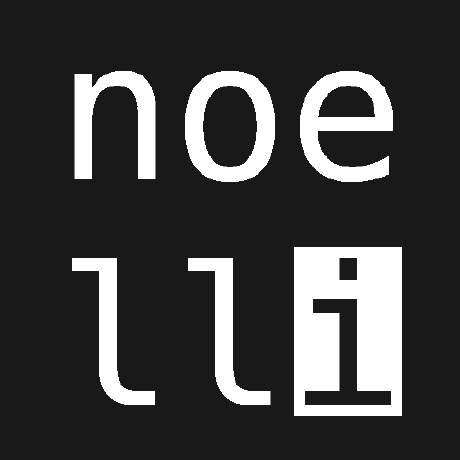

<h1 class="header center"></h1>
<h3 class="no-top-margin header center"></h3>
 

    

        
    

    

        

            
        

        

            <a class="icon-large green-text" target="_blank" href="mailto:{{ site.email }}"><i class="fa fa-envelope green-text" style=""></i> </a>
        

    

    

        

            
        

        

            <form action="https://www.paypal.com/donate" method="post" target="_top">
                <input type="hidden" name="hosted_button_id" value="96QF69TJDWTPS" />
                <input type="image" src="https://www.paypalobjects.com/en_US/DK/i/btn/btn_donateCC_LG.gif" border="0" name="submit" title="PayPal - The safer, easier way to pay online!" alt="Donate with PayPal button" />
                
            </form>
        

    

    

        

            <h5> & :</h5>
        

        

            <a  class="btn btn-flat waves-effect waves-light waves-green icon-large tooltipped"
                data-position="top"
                data-tooltip="python.org"
                href="https://python.org">
                <i class="fab fa-python"></i>
            </a>
            <a  class="btn btn-flat waves-effect waves-light waves-green icon-large tooltipped" 
                data-position="top" 
                data-tooltip="flask.palletsprojects.com" 
                href="https://flask.palletsprojects.com/">
                
                
            </a>
            <a  class="btn btn-flat waves-effect waves-light waves-green icon-large tooltipped" 
                data-position="top"
                data-tooltip="dart.dev" 
                href="https://dart.dev/">
                
            </a>
            <a  class="btn btn-flat waves-effect waves-light waves-green icon-large tooltipped" 
                data-position="top" 
                data-tooltip="flutter.dev" 
                href="https://flutter.dev">
                
                
            </a>
        

    

    

        

            <h5>:</h5>
        

        

            <a  class="btn btn-flat waves-effect waves-light waves-green icon-large tooltipped"
                data-position="top"
                data-tooltip="nginx.org"
                href="https://nginx.org">
                NGINX
            </a>
            <a  class="btn btn-flat waves-effect waves-light waves-green icon-large tooltipped"
                data-position="top"
                data-tooltip="inga-hameln.de"
                href="http://www.inga-hameln.de/ibms">
                iBMS
            </a>
            <a  class="btn btn-flat waves-effect waves-light waves-green icon-large tooltipped"
                data-position="top"
                data-tooltip="bacnet.org"
                href="http://www.bacnet.org/">
                BACnet
            </a>
        

    

    <h5></h5>

 